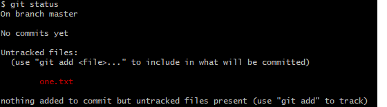
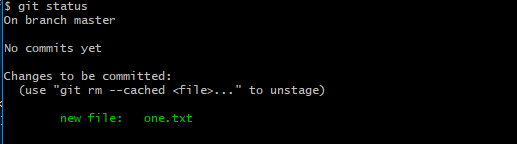

#### 三种状态
git有三种状态，你的文件可能处于其中之一：已提交（committed）、已修改（modified）和已暂存（staged）。已提交表示数据已经安全存储到本地数据库中。已修改表示修改了文件，但还没有保存到数据库中。已暂存表示对一个已经修改的文件的当前版本做了标记，使之包含在下次提交的快照中。  
  
  
新增一个文件one.txt，然后使用git status 查看当前文件状态， 当前文件没有被跟踪。
 
   
使用git add one.txt，把one这个文件状态修改为已暂存，待提交状态。再使用git status查看当前文件状态

然后使用git commit one.txt，现在one这个文件的状态，就是已经commited状态。  
然后再修改one这个文件，此时one这个文件就是modified状态，现在可以直接使用git commit one.txt -m 'message'这个命令使这个文件状态变成commited状态，也可以使用git add one.txt，one文件变成已暂存状态。

#### 安装之后的初始配置
git config 可以帮助设置控制git外观和行为的配置变量，这些变量存储在三个不同的位置。  
1. 在windows系统中，如果待上--system，修改的配置是在git安装目录下面，mingw64\etc目录下的gitconfig这个文件的配置。我的git安装目录是c盘，位置是（C:\Program Files\Git\mingw64\etc）
2. 带上--global ，修改和查看的是%HOMEPATH%目录下的.gitconfig文件。  
3. 如果没有参数，修改的是当前仓库.git/.gitconfig的内容